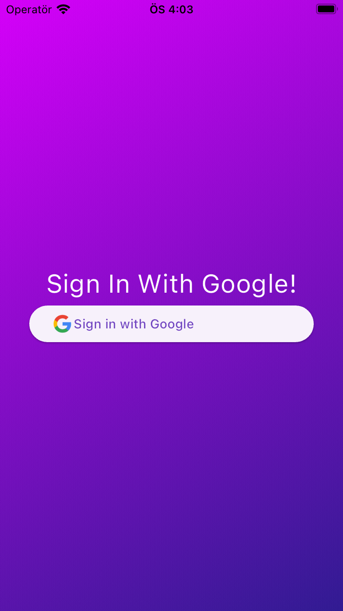

# Flutter Chat App

Flutter Chat App, Google ile giriş yapılabilen, internet bağlantısı kontrolü yapılan ve kullanıcıların kayıtlı sohbet odaları arasında mesajlaşabildiği bir mesajlaşma uygulamasıdır. Uygulama, Flutter kullanılarak geliştirilmiştir ve Firebase ile entegre çalışır.

## Özellikler

- Splash screen ile uygulama başlatma ve internet bağlantısı kontrolü.
- Google ile otomatik giriş yapma özelliği.
- Kullanıcıların daha önce giriş yapıp yapmadığının kontrolü.
- Kayıtlı sohbet odalarının görüntülenmesi.
- Yeni sohbet odaları oluşturma ve mevcut sohbet odalarına erişim.
- Metin tabanlı mesajlaşma.

## Kullanılan Paketler

Aşağıdaki paketler, uygulamanın geliştirilmesi sırasında kullanılmıştır. Paket adlarına tıklayarak daha fazla bilgi edinebilirsiniz.

- [equatable](https://pub.dev/packages/equatable)
- [provider](https://pub.dev/packages/provider)
- [firebase_core](https://pub.dev/packages/firebase_core)
- [firebase_auth](https://pub.dev/packages/firebase_auth)
- [google_sign_in](https://pub.dev/packages/google_sign_in)
- [hive_flutter](https://pub.dev/packages/hive_flutter)
- [hive](https://pub.dev/packages/hive)
- [hive_generator](https://pub.dev/packages/hive_generator)
- [cloud_firestore](https://pub.dev/packages/cloud_firestore)
- [connectivity_plus](https://pub.dev/packages/connectivity_plus)

## Kullanım

Uygulama başlatıldığında, otomatik olarak splash screen görüntülenir ve internet bağlantısı kontrol edilir. İnternet bağlantısı varsa ve kullanıcı daha önce giriş yapmışsa, doğrudan home sayfasına yönlendirilir. Eğer kullanıcı giriş yapmamışsa, giriş sayfasına yönlendirilir ve Google ile giriş yapabilir.

Home sayfasında, kullanıcı kayıtlı sohbet odalarını görüntüleyebilir ve yeni sohbet odaları oluşturabilir. Bir kullanıcı ile daha önce sohbet odası oluşturulmuşsa, kullanıcı doğrudan o sohbet odasına yönlendirilir.

## ScreenShots

  
  
  
  
  
  
  
  <!-- Buraya diğer ekran görüntüleri eklenir -->

## Kurulum

Uygulamayı çalıştırmak için öncelikle Flutter'ın kurulu olması gerekmektedir. Kurulum için [Flutter'ın resmi web sitesindeki](https://flutter.dev/docs/get-started/install) talimatları takip edebilirsiniz.
æ
